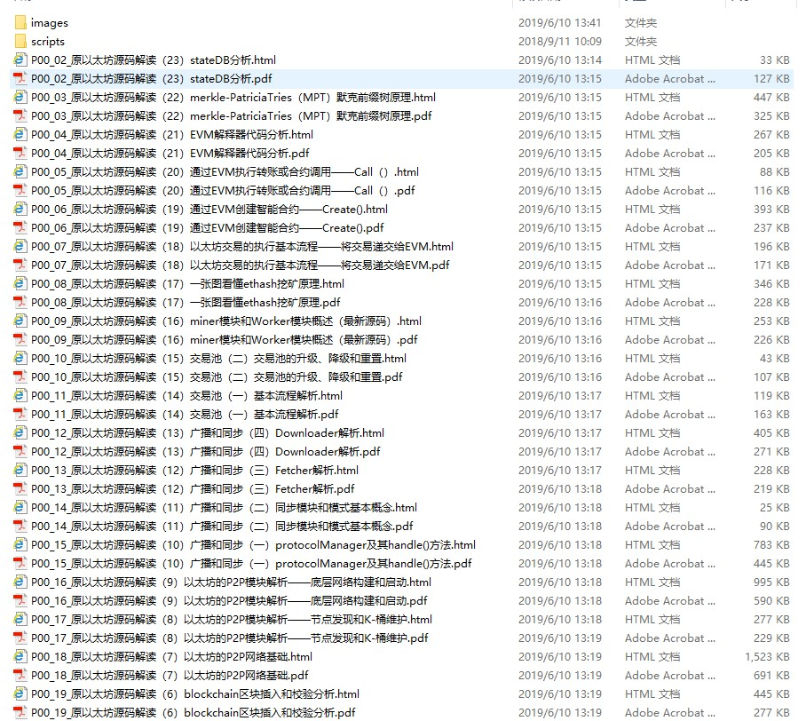
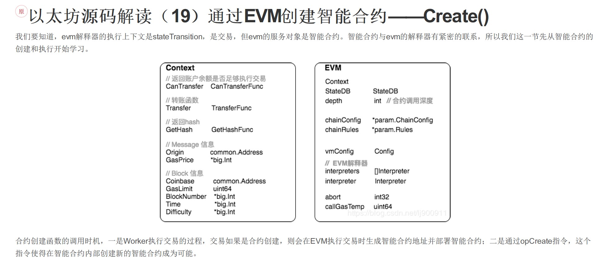

# CSDN_Blog2PDF
Convert CSDN Blog to PDF while keeping all codes, images and formulas as they were. 转换CSDN博客到PDF格式，保持代码、图片和公式完全不变，方便打印留档. 
 

## Update : 

## Update 20190610
0610 Updates:
* Fix : Crash when applying to the latest CSDN website 更新对新版本CSDN网站的适配
* Fix : Crash when saving some hidden blogs 更新隐藏博文忽略处理
* Fix : Malfuntion when crawling through multiple pages 修复多页博客的连续爬取故障

Old Updates:
* New : Update requirements.txt
* New : Better look in HTML and PDF files
* Fix : Multiple crash happened when blog is not properly written
* Fix : File saving error due to prohibited characters in file name

 

## Demo
running build.20190610

## Compatibility
Python3 or Newer. 
 

## Requirements
20181029更新：已添加`requirements.txt`，可以在文件夹中运行`pip3 install -r requirements.txt`进行环境一键配置！ 
要求安装`shutil`、`bs4`、`pdfkit`和`wkhtmltopdf`。 
Requiring installation of `shutil`,`bs4`,`pdfkit`and`wkhtmltopdf`. 
前三个可以直接用pip命令安装，`wkhtmltopdf`不是Python的库的安装链接如下： 
`wkhtmltopdf` can be downloaded from the following web page: 
[https://wkhtmltopdf.org/](https://wkhtmltopdf.org/)  
 

## Instructions
环境配置完成后，请直接用Python运行main.py或直接运行批处理run.bat，按照图形界面中的指示进行操作。下载后的博客都在`csdn_blog`文件夹下。 
After installing those dependencies, you may directly running main.py or run.bat. Follow the instructions in the pop-up window. The downloaded PDF & HTML files are all in the `csdn_blog` directory. 
